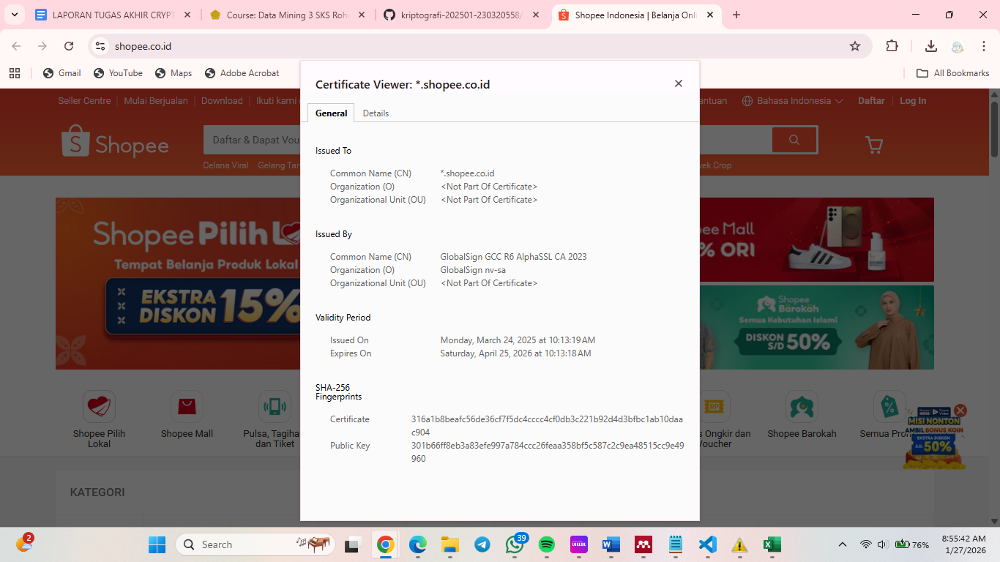
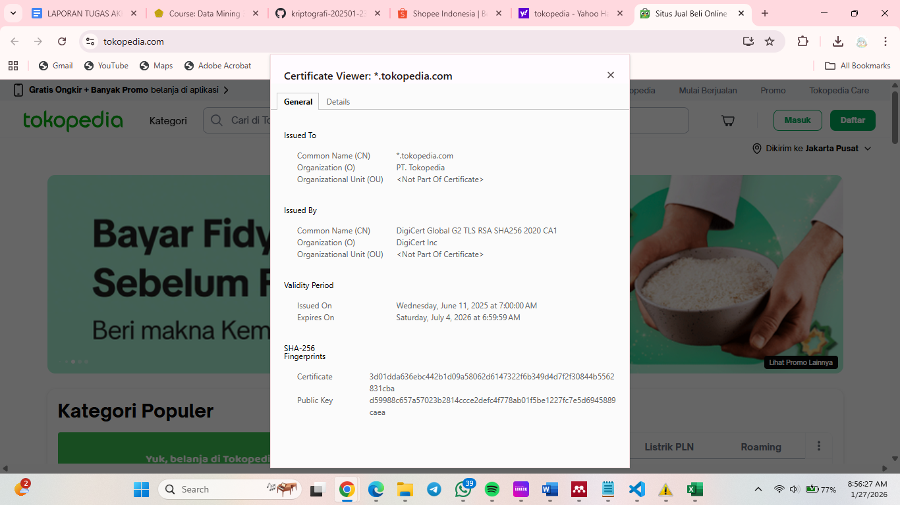

# Laporan Praktikum Kriptografi
Minggu ke-: 12 
Topik: Aplikasi TLS & E-commerce  
Nama: Putri Tripangesti  
NIM: 230320558  
Kelas: 5DSRA  

---

## 1. Tujuan
1. Menganalisis penggunaan kriptografi pada email dan SSL/TLS.
2. Menjelaskan enkripsi dalam transaksi e-commerce.
3. Mengevaluasi isu etika & privasi dalam penggunaan kriptografi di kehidupan sehari-hari.

---

## 2. Dasar Teori
Transport Layer Security (TLS) merupakan protokol kriptografi yang digunakan untuk mengamankan komunikasi data antara klien dan server pada jaringan internet. TLS menyediakan tiga layanan utama, yaitu kerahasiaan (confidentiality) melalui enkripsi data, integritas melalui mekanisme Message Authentication Code (MAC), dan autentikasi melalui sertifikat digital berbasis Public Key Infrastructure (PKI). Dalam proses *handshake*, TLS memungkinkan kedua pihak untuk menyepakati algoritma kriptografi dan kunci sesi secara aman sebelum pertukaran data berlangsung.

Dalam konteks e-commerce, TLS berperan penting dalam melindungi transaksi online, seperti pengiriman data pribadi, informasi akun, dan detail pembayaran pelanggan. Dengan penggunaan sertifikat digital, TLS memastikan bahwa pengguna berkomunikasi dengan server yang sah dan bukan pihak palsu, sehingga mencegah serangan seperti *man-in-the-middle*. Selain itu, enkripsi pada TLS menjamin bahwa data transaksi tidak dapat dibaca atau dimodifikasi oleh pihak yang tidak berwenang selama proses pengiriman.

Penerapan TLS pada platform e-commerce meningkatkan kepercayaan pengguna dan menjadi standar keamanan yang wajib diterapkan. Protokol ini mendukung terciptanya lingkungan transaksi yang aman, andal, dan sesuai dengan praktik keamanan modern. Oleh karena itu, TLS merupakan komponen krusial dalam infrastruktur e-commerce untuk menjaga keamanan data dan kelangsungan bisnis digital.

---

## 3. Alat dan Bahan
- Visual Studio Code   
- Git dan akun GitHub  

---

## 4. Langkah Percobaan
Langkah 1 - Analisis SSL/TLS pada Email & Web
Langlah 2 - Studi Kasus E-commerce
Langkah 3 - Analisis Etika dan Privasi

---

## 5. Source Code
-

---

## 6. Hasil dan Pembahasan



Langkah 1 — Analisis SSL/TLS pada Email & Web
- Shopee (https://shopee.co.id)
Issuer CA: GlobalSign GCC R6 AlphaSSL CA 2023
Masa berlaku Sertifikat: Issued on 24 March 2025, expires on 25 April 2026
Algoritma enkripsi: Menggunakan RSA Public Key dan hash/fingerprint SHA-256

- Tokopedia
Issuer CA: DigiCert Global G2 TLS RSA SHA256 2020 CA1
Masa berlaku: Issued on 11 June 2025, expires on 4 July 2026
Algoritma enkripsi: RSA + SHA-256

Perbedaan website HTTPS vs tanpa HTTPS: 
- Website dengan HTTPS
Data terenkripsi (username, password, transaksi aman), ada sertifikat digital (CA terpercaya), mencegah Man-in-the-Middle attack, browser menampilkan ikon 🔒, lebih dipercaya user + SEO lebih bagus

- Website tanpa HTTPS (HTTP saja)
Data dikirim plain text, mudah disadap, tidak ada verifikasi identitas server, browser biasanya muncul peringatan “Not Secure”, sangat berbahaya untuk login/pembayaran.


Langkah 2 — Studi Kasus E-commerce
- Analisis bagaimana enkripsi digunakan untuk melindungi transaksi online (misalnya saat login atau melakukan pembayaran).

Pada transaksi online seperti proses login maupun pembayaran, enkripsi berperan penting dalam menjaga kerahasiaan dan integritas data pengguna. Website e-commerce seperti Shopee dan Tokopedia menggunakan protokol TLS (Transport Layer Security) yang memanfaatkan algoritma kriptografi asimetris dan simetris secara bersamaan.

Pada tahap awal koneksi, browser dan server melakukan TLS Handshake. Server mengirimkan sertifikat digital yang berisi public key (RSA) dan identitas website yang telah diverifikasi oleh Certificate Authority (CA). Browser kemudian memverifikasi sertifikat tersebut untuk memastikan bahwa server benar-benar asli, bukan pihak palsu.

Selanjutnya, browser membuat session key yang dienkripsi menggunakan public key server (RSA). Setelah kunci sesi terbentuk, komunikasi berikutnya menggunakan enkripsi simetris (biasanya AES) karena lebih cepat dan efisien. Dengan mekanisme ini:

1. Data sensitif seperti username, password, nomor kartu, dan OTP tidak dapat dibaca oleh pihak ketiga.
2. Integritas data terjamin, sehingga isi pesan tidak bisa diubah selama transmisi.
3. Autentikasi server memastikan pengguna terhubung ke website yang sah.


- Diskusikan potensi ancaman jika TLS tidak digunakan (contoh: serangan Man-in-the-Middle).

Apabila TLS tidak diterapkan (misalnya website masih menggunakan HTTP), maka komunikasi dilakukan dalam bentuk plain text. Kondisi ini membuka peluang berbagai serangan keamanan, antara lain:

1. Man-in-the-Middle (MitM)
Penyerang dapat menyisipkan diri di antara pengguna dan server lalu mengintip data login, mencuri informasi kartu kredit, dan mengubah isi transaksi tanpa disadari pengguna.

2. Packet Sniffing
Data yang dikirim dapat ditangkap menggunakan tools jaringan (seperti Wireshark), sehingga kredensial pengguna bisa terlihat secara langsung.

3. Session Hijacking
Penyerang dapat mengambil session cookie pengguna dan masuk ke akun korban tanpa perlu password.

4. Phishing dan Website Palsu
Tanpa validasi sertifikat, pengguna sulit membedakan website asli dan palsu, sehingga mudah tertipu.


Langkah 3 — Analisis Etika & Privasi
- Identifikasi isu privasi dalam penggunaan email terenkripsi (PGP, S/MIME).
PGP dan S/MIME melindungi isi email menggunakan enkripsi kunci publik, sehingga hanya penerima yang dapat membaca pesan. Namun, masih terdapat isu privasi seperti metadata email (pengirim, penerima, waktu) yang tidak terenkripsi, risiko kebocoran private key, serta ketergantungan pada Certificate Authority (khusus S/MIME).

- Diskusikan dilema etika:
Perusahaan boleh melakukan audit email kerja demi keamanan dan kepatuhan, asal ada kebijakan jelas dan transparan. Namun, pengawasan berlebihan melanggar privasi karyawan. Idealnya dilakukan hanya saat diperlukan (misalnya investigasi).

-Bagaimana kebijakan pemerintah dalam pengawasan komunikasi terenkripsi?
Pemerintah ingin mengawasi komunikasi terenkripsi untuk keamanan nasional, tetapi membuka akses atau backdoor dapat melemahkan sistem enkripsi dan mengancam privasi masyarakat.

---

## 7. Jawaban Pertanyaan 
1.  Apa perbedaan utama antara HTTP dan HTTPS?
2. Mengapa sertifikat digital menjadi penting dalam komunikasi TLS?
3. Bagaimana kriptografi mendukung privasi dalam komunikasi digital, tetapi sekaligus menimbulkan tantangan hukum dan etika?

- Pertanyaan 1: Perbedaan utama antara HTTP dan HTTPS terletak pada keamanannya. HTTP mengirimkan data tanpa enkripsi sehingga informasi dapat dengan mudah disadap oleh pihak lain, sedangkan HTTPS menggunakan SSL/TLS untuk mengenkripsi data dan memverifikasi identitas server melalui sertifikat digital, sehingga komunikasi menjadi lebih aman.

- Pertanyaan 2: Sertifikat digital menjadi penting dalam komunikasi TLS karena berfungsi untuk membuktikan identitas server serta menyediakan public key yang digunakan dalam proses enkripsi. Dengan adanya sertifikat digital, pengguna dapat memastikan bahwa mereka terhubung ke server yang asli dan bukan pihak palsu, sekaligus mencegah serangan seperti man-in-the-middle.

- Pertanyaan 3: Kriptografi mendukung privasi dalam komunikasi digital dengan mengenkripsi data sehingga pesan dan informasi pribadi tidak dapat dibaca oleh pihak yang tidak berwenang, namun pada saat yang sama menimbulkan tantangan hukum dan etika karena enkripsi yang kuat dapat dimanfaatkan untuk aktivitas ilegal dan menyulitkan aparat penegak hukum dalam melakukan penyelidikan, sehingga muncul konflik antara hak privasi individu dan kepentingan keamanan publik.

---

## 8. Kesimpulan
Transport Layer Security (TLS) merupakan teknologi penting dalam aplikasi komunikasi digital karena berfungsi mengamankan pertukaran data melalui proses enkripsi, autentikasi, dan integritas informasi. Dengan penerapan TLS, aplikasi dapat melindungi data pengguna dari penyadapan, pemalsuan, dan manipulasi selama proses transmisi. Keberadaan sertifikat digital memungkinkan verifikasi identitas server sehingga meningkatkan kepercayaan pengguna terhadap layanan yang diakses. Oleh karena itu, TLS menjadi fondasi utama dalam membangun sistem aplikasi yang aman, andal, dan menjaga privasi, terutama pada layanan berbasis internet seperti web, email, dan transaksi online.

---

## 9. Daftar Pustaka
(Cantumkan referensi yang digunakan.  
Contoh:  
- Katz, J., & Lindell, Y. *Introduction to Modern Cryptography*.  
- Stallings, W. *Cryptography and Network Security*.  )

---

## 10. Commit Log
commit week12-aplikasi-tls
Author: Putri Tripangesti <putritpgst@gmail.com>
Date:   2026-01-27

    week12-aplikasi-tls: implementasi Aplikasi TLS & E-commerce dan laporan.
```
