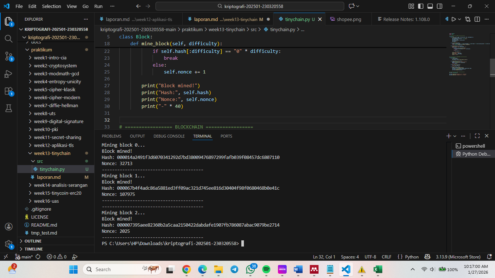

# Laporan Praktikum Kriptografi
Minggu ke-: 13
Topik: TinyChain – Proof of Work (PoW)  
Nama: Putri Tripangesti  
NIM: 230320558  
Kelas: 5DSRA 

---

## 1. Tujuan
1. Menjelaskan peran hash function dalam blockchain.
2. Melakukan simulasi sederhana Proof of Work (PoW).
3. Menganalisis keamanan cryptocurrency berbasis kriptografi.

---

## 2. Dasar Teori
TinyChain merupakan implementasi blockchain sederhana yang digunakan untuk tujuan pembelajaran, khususnya untuk memahami mekanisme dasar teknologi blockchain seperti struktur blok, hash kriptografi, dan konsensus jaringan. TinyChain meniru cara kerja blockchain nyata dengan menyusun data dalam bentuk blok yang saling terhubung melalui hash, sehingga menjamin integritas data dan mencegah perubahan informasi secara sepihak.

Dalam TinyChain, mekanisme konsensus yang digunakan adalah Proof of Work (PoW), yaitu metode validasi blok yang mengharuskan miner menyelesaikan persoalan komputasi berupa pencarian nilai nonce agar hash blok memenuhi tingkat kesulitan tertentu. Proses ini membutuhkan daya komputasi, sehingga membuat manipulasi data menjadi mahal dan sulit dilakukan. Blok yang berhasil divalidasi kemudian ditambahkan ke rantai sebagai blok baru.

Penerapan PoW pada TinyChain bertujuan untuk memperlihatkan bagaimana keamanan blockchain dibangun melalui kerja komputasi dan verifikasi hash. Meskipun bersifat sederhana dibanding blockchain nyata seperti Bitcoin, TinyChain cukup efektif sebagai media simulasi untuk memahami konsep desentralisasi, konsensus, serta perlindungan data dalam sistem terdistribusi.

---

## 3. Alat dan Bahan
- Visual Studio Code 
- Git dan akun GitHub

---

## 4. Langkah Percobaan
1. Membuat file `tinychain.py` di folder `praktikum/week13-tinychain/src/`.
2. Menyalin kode program dari panduan praktikum.
3. Menjalankan program dengan perintah `python tinychain.py`.

---

## 5. Source Code
import hashlib
import time

# ================= BLOCK =================
class Block:
    def __init__(self, index, previous_hash, data, timestamp=None):
        self.index = index
        self.timestamp = timestamp or time.time()
        self.data = data
        self.previous_hash = previous_hash
        self.nonce = 0
        self.hash = ""

    def calculate_hash(self):
        value = str(self.index) + str(self.timestamp) + str(self.data) + str(self.previous_hash) + str(self.nonce)
        return hashlib.sha256(value.encode()).hexdigest()

    def mine_block(self, difficulty):
        print(f"Mining block {self.index}...")
        while True:
            self.hash = self.calculate_hash()
            if self.hash[:difficulty] == "0" * difficulty:
                break
            else:
                self.nonce += 1

        print("Block mined!")
        print("Hash:", self.hash)
        print("Nonce:", self.nonce)
        print("-" * 40)


# ================= BLOCKCHAIN =================
class Blockchain:
    def __init__(self):
        self.difficulty = 4
        self.chain = [self.create_genesis_block()]

    def create_genesis_block(self):
        genesis = Block(0, "0", "Genesis Block")
        genesis.mine_block(self.difficulty)
        return genesis

    def get_latest_block(self):
        return self.chain[-1]

    def add_block(self, data):
        latest = self.get_latest_block()
        new_block = Block(len(self.chain), latest.hash, data)
        new_block.mine_block(self.difficulty)
        self.chain.append(new_block)


# ================= TEST =================
my_chain = Blockchain()

my_chain.add_block("Transaksi A → B : 10 Coin")
my_chain.add_block("Transaksi B → C : 5 Coin")

---

## 6. Hasil dan Pembahasan
Hasil eksekusi program Tinychain:



Berdasarkan hasil pengujian, seluruh blok berhasil ditambang dengan menghasilkan hash yang diawali empat angka nol sesuai tingkat kesulitan yang ditetapkan. Hal ini menunjukkan bahwa mekanisme Proof of Work berjalan dengan baik, di mana sistem harus melakukan percobaan nonce berulang hingga menemukan hash yang valid. Setiap blok juga terhubung dengan blok sebelumnya melalui nilai previous hash, sehingga membentuk rantai yang saling bergantung. Perubahan data pada satu blok akan mengakibatkan hash berubah dan membuat blockchain menjadi tidak valid, yang membuktikan sifat immutability pada TinyChain.

Dengan demikian, hasil pengujian sesuai dengan ekspektasi, yaitu:
- Proof of Work berhasil diterapkan
- Mining membutuhkan komputasi nyata
- Setiap blok tervalidasi dengan hash unik
- Integritas data blockchain terjaga

---

## 7. Jawaban Pertanyaan
1. Mengapa fungsi hash sangat penting dalam blockchain?
2. Bagaimana Proof of Work mencegah double spending?
3. Apa kelemahan dari PoW dalam hal efisiensi energi?

- Pertanyaan 1: Fungsi hash berperan sebagai mekanisme pengaman utama dalam blockchain karena menghasilkan nilai unik untuk setiap blok berdasarkan isi datanya. Hash memastikan integritas data, sebab perubahan sekecil apa pun pada transaksi akan menghasilkan hash yang berbeda secara signifikan. Selain itu, hash menghubungkan setiap blok dengan blok sebelumnya (previous hash), sehingga membentuk rantai yang tidak dapat dimodifikasi tanpa memengaruhi seluruh blok setelahnya.

- Pertanyaan 2: Proof of Work mencegah double spending dengan mewajibkan setiap transaksi divalidasi melalui proses mining yang membutuhkan usaha komputasi. Ketika sebuah transaksi telah dimasukkan ke dalam blok dan berhasil ditambang, transaksi tersebut menjadi bagian permanen dari blockchain. Untuk mengubahnya, pelaku harus menambang ulang blok tersebut beserta seluruh blok berikutnya dengan kecepatan melebihi jaringan, yang secara praktis sangat sulit dan mahal, sehingga mencegah pengeluaran ganda atas aset yang sama.

- Pertanyaan 3: Kelemahan utama Proof of Work adalah konsumsi energi yang sangat besar karena proses mining melibatkan perhitungan hash secara berulang oleh banyak node secara bersamaan. Sebagian besar daya komputasi tersebut terbuang karena hanya satu miner yang berhasil menemukan solusi, sementara usaha miner lainnya menjadi sia-sia. Hal ini menyebabkan PoW dianggap tidak ramah lingkungan serta kurang efisien dibandingkan mekanisme konsensus alternatif seperti Proof of Stake.

---

## 8. Kesimpulan
Berdasarkan hasil percobaan, mekanisme Proof of Work pada TinyChain berhasil memvalidasi setiap blok melalui proses mining dengan menghasilkan hash sesuai tingkat kesulitan yang ditentukan. Setiap blok terhubung secara aman menggunakan hash sebelumnya, sehingga integritas data tetap terjaga. Namun, proses ini membutuhkan komputasi yang cukup besar, menunjukkan bahwa PoW kurang efisien dari sisi energi.

---

## 9. Daftar Pustaka
(Cantumkan referensi yang digunakan.  
Contoh:  
- Katz, J., & Lindell, Y. *Introduction to Modern Cryptography*.  
- Stallings, W. *Cryptography and Network Security*.  )

---

## 10. Commit Log
commit week13-tinychain
Author: Putri Tripangesti <putritpgst@gmail.com>
Date:   2026-01-27

    week13-tinychain: implementasi TinyChain – Proof of Work (PoW) dan laporan 

```
